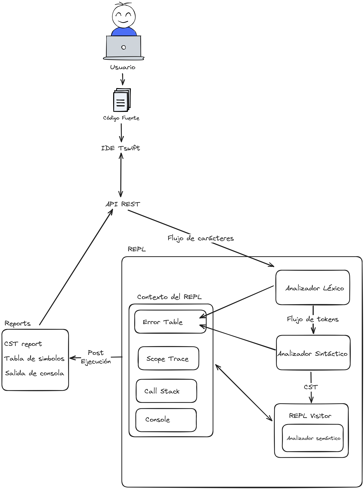
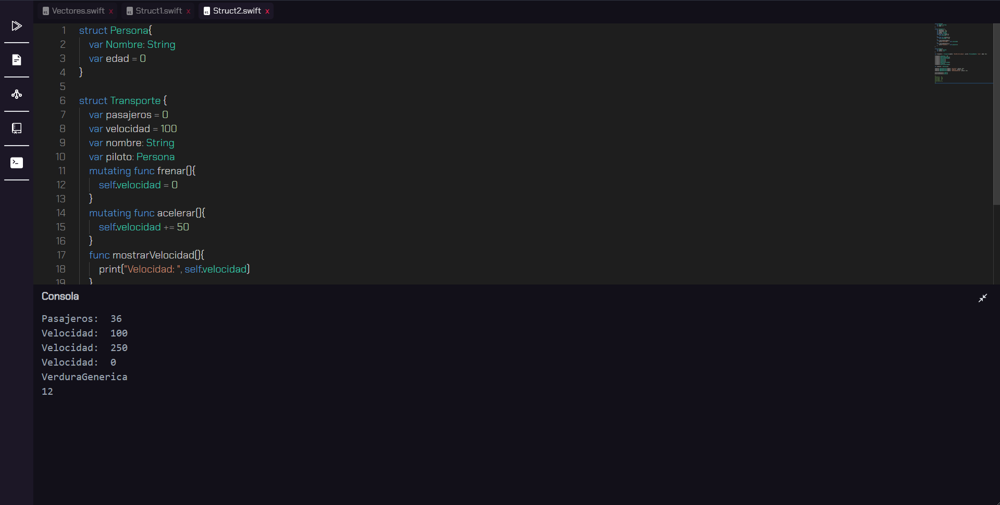

# **Proyecto 2**
### Universidad de San Carlos de Guatemala
### Facultad de Ingeniería
### Escuela de Ciencias y Sistemas
### Organización de Lenguajes y Compiladores 2
<br></br>

## **Manual Técnico**
<br></br>

| Nombre | Carnet | 
| --- | --- |
| Damián Ignacio Peña Afre | 202110568 |
----

## **Tabla de Contenido**
- [Descripción General](#descripción-general)
- [Descripción de la solución](#descripción-de-la-solución)
- [Estructura del interpréte](#estructura-del-interpréte)
- [Analísis Léxico](#analísis-léxico)
- [Analísis Sintáctico](#análisis-sintáctico)
- [Análisis Semántico](#análisis-semántico)
- [Manejo de errores](#manejo-de-errores)
- [Consideraciones del lenguaje](#consideraciones-del-lenguaje)
- [Patrón Visitor](#patrón-visitor)
- [Estructuras de datos relevantes](#estructuras-de-datos-relevantes)
- [Interfaz gráfica](#interfaz-gráfica)

## **Descripción General**


T-Swift es un lenguaje de programación basado en el popular lenguaje Swift. Swift es ampliamente reconocido por su sintaxis moderna y sus características distintivas que lo han convertido en una elección preferida en el mundo de la programación. T-Swift hereda estas cualidades, lo que lo convierte en un lenguaje multiparadigma versátil y en constante crecimiento.

### Características Destacadas
T-Swift se destaca por incorporar características avanzadas que lo hacen adecuado para una amplia gama de aplicaciones. Algunas de sus características más notables incluyen:

1. Programación Funcional: T-Swift permite la implementación de conceptos de programación funcional, lo que facilita la escritura de código más claro y conciso.

2. Tipado Estático: Con un sistema de tipado estático robusto, T-Swift ayuda a detectar errores en tiempo de compilación, lo que conduce a un código más seguro y confiable.

3. Inferencia de Tipos: La inferencia de tipos en T-Swift simplifica la declaración de variables al permitir que el compilador deduzca automáticamente los tipos de datos, lo que reduce la verbosidad del código.


## **Descripción de la solución**

Para la implementación del proyecto se utilizó el lenguaje de programación Go. Afortunadamente Go cuenta con un entorno adecuado para esta tarea, contando con herramientas como antlr4, que  permite generar un lexer y parser a partir de una gramática o Fiber, que permite la creación de una API para la comunicación con la interfaz gráfica.

La arquitecura del proyecto se basa en una aplicación de React con Typescript para la interfaz gráfica, un servidor en Go que se encarga de la comunicación con la interfaz gráfica y la generación de reportes. Entre uno de los lenguajes por los que se optó para la reportería se encuentra Graphviz, el cual permite generar reportes de la tabla de símbolos.

## **Estructura del interpréte**



## **Analísis Léxico**

Para el análisis léxico se utilizó la herramienta antlr4, la cual permite generar un lexer a partir de una gramática. La gramática utilizada para el lexer se encuentra en el archivo `TSwiftLexer.g4`. El lexer se encarga de generar tokens a partir de la entrada, los cuales son utilizados por el parser para generar el AST. Se presenta un resumen de los tokens generados por el lexer:

`COMMENT`, `MULTILINE_COMMENT`, `SEMICOLON`, `LET_KW`, `VAR_KW`, `FUNC_KW`, `STRUCT_KW`, `IF_KW`, `ELSE_KW`, `SWITCH_KW`, `CASE_KW`, `DEFAULT_KW`, `FOR_KW`, `WHILE_KW`, `BREAK_KW`, `CONTINUE_KW`, `RETURN_KW`, `GUARD_KW`, `INOUT_KW`, `MUTATING_KW`, `IN_KW`, `INTEGER_LITERAL`, `FLOAT_LITERAL`, `STRING_LITERAL`, `BOOL_LITERAL`, `NIL_LITERAL`, `ID`, `PLUS`, `MINUS`, `MULT`, `DIV`, `MOD`, `EQUALS`, `PLUS_EQUALS`, `MINUS_EQUALS`, `EQUALS_EQUALS`, `NOT_EQUALS`, `LESS_THAN`, `LESS_THAN_OR_EQUAL`, `GREATER_THAN`, `GREATER_THAN_OR_EQUAL`, `AND`, `OR`, `NOT`, `LPAREN`, `RPAREN`, `LBRACE`, `RBRACE`, `LBRACK`, `RBRACK`, `COMMA`, `DOT`, `COLON`, `ARROW`, `INTERROGATION`, `ANPERSAND`

## **Analísis Sintáctico**

Para el análisis sintáctico se utilizó la herramienta antlr4, la cual permite generar un parser a partir de una gramática. La gramática utilizada para el parser se encuentra en el archivo `TSwiftLanguage.g4`. El parser se encarga de generar el AST a partir de los tokens generados por el lexer. Se presenta un resumen de las reglas de la gramática:

```g4
program: (stmt)* EOF?;
delimiter: SEMICOLON? | EOF;

stmt:
	decl_stmt delimiter
	| assign_stmt delimiter
	| transfer_stmt delimiter
	| if_stmt
	| switch_stmt
	| while_stmt
	| for_stmt
	| guard_stmt
	| func_call delimiter
	| vector_func delimiter
	| func_dcl
	| strct_dcl;

decl_stmt:
	var_type ID COLON type EQUALS expr		# TypeValueDecl
	| var_type ID EQUALS expr				# ValueDecl
	| var_type ID COLON type INTERROGATION	# TypeDecl;

vector_expr:
	LBRACK (expr (COMMA expr)*)? RBRACK # VectorItemList;

vector_item: id_pattern (LBRACK expr RBRACK)+ # VectorItem;

vector_prop: vector_item DOT id_pattern # VectorProp;
vector_func: vector_item DOT func_call # VectorFunc;

repeating:
	(vector_type | matrix_type) LPAREN ID COLON expr COMMA ID COLON expr RPAREN;

var_type: VAR_KW | LET_KW;

type: ID | vector_type | matrix_type;

vector_type: LBRACK ID RBRACK;

matrix_type: aux_matrix_type | LBRACK LBRACK ID RBRACK RBRACK;

aux_matrix_type: LBRACK matrix_type RBRACK;

assign_stmt:
	id_pattern EQUALS expr											# DirectAssign
	| id_pattern op = (PLUS_EQUALS | MINUS_EQUALS) expr				# ArithmeticAssign
	| vector_item op = (PLUS_EQUALS | MINUS_EQUALS | EQUALS) expr	# VectorAssign;

id_pattern: ID (DOT ID)* # IdPattern;

literal:
	INTEGER_LITERAL		# IntLiteral
	| FLOAT_LITERAL		# FloatLiteral
	| STRING_LITERAL	# StringLiteral
	| BOOL_LITERAL		# BoolLiteral
	| NIL_LITERAL		# NilLiteral;

expr:
	LPAREN expr RPAREN									# ParenExp // (a)
	| func_call											# FuncCallExp // a.a.a()
	| id_pattern										# IdExp // a.a.a
	| vector_item										# VectorItemExp // a.a.a[0]
	| vector_prop										# VectorPropExp // a[0].a.a
	| vector_func										# VectorFuncExp // a[0].a.a()
	| literal											# LiteralExp // 1, 1.0, "a", true, nil
	| vector_expr										# VectorExp // [1, 2, 3]
	| repeating											# RepeatingExp // [ Int ] (repeating: 0, count: 3)
	| struct_vector										# StructVectorExp // [ Int ]()	
	| op = (NOT | MINUS) expr							# UnaryExp // !a, -a	
	| left = expr op = (MULT | DIV | MOD) right = expr	# BinaryExp // a * b, a / b, a % b
	| left = expr op = (PLUS | MINUS) right = expr		# BinaryExp // a + b, a - b
	| left = expr op = (
		LESS_THAN
		| LESS_THAN_OR_EQUAL
		| GREATER_THAN
		| GREATER_THAN_OR_EQUAL
	) right = expr													# BinaryExp // a < b, a <= b, a > b, a >= b
	| left = expr op = (EQUALS_EQUALS | NOT_EQUALS) right = expr	# BinaryExp // a == b, a != b
	| left = expr op = AND right = expr								# BinaryExp // a && b
	| left = expr op = OR right = expr								# BinaryExp; // a || b
// StructMethodCallExp, StructPropertyCallExp, FunctionCallExp, vector, matrix;  (++, --)?

if_stmt: if_chain (ELSE_KW if_chain)* else_stmt? # IfStmt;

if_chain: IF_KW expr LBRACE stmt* RBRACE # IfChain;
else_stmt: ELSE_KW LBRACE stmt* RBRACE # ElseStmt;

switch_stmt:
	SWITCH_KW expr LBRACE switch_case* default_case? RBRACE # SwitchStmt;

switch_case: CASE_KW expr COLON stmt* # SwitchCase;

default_case: DEFAULT_KW COLON stmt* # DefaultCase;

while_stmt: WHILE_KW expr LBRACE stmt* RBRACE # WhileStmt;

for_stmt:
	FOR_KW ID IN_KW (expr | range) LBRACE stmt* RBRACE # ForStmt;

range: expr DOT DOT DOT expr # NumericRange;

guard_stmt:
	GUARD_KW expr ELSE_KW LBRACE stmt* RBRACE # GuardStmt;

transfer_stmt:
	RETURN_KW expr?	# ReturnStmt
	| BREAK_KW		# BreakStmt
	| CONTINUE_KW	# ContinueStmt;

func_call: id_pattern LPAREN arg_list? RPAREN # FuncCall;

// external names -> num: value, num2: value2
arg_list: func_arg (COMMA func_arg)* # ArgList;
func_arg: (ID COLON)? (ANPERSAND)? (id_pattern | expr) # FuncArg; // 

func_dcl:
	FUNC_KW ID LPAREN param_list? RPAREN (ARROW type)? LBRACE stmt* RBRACE # FuncDecl;

param_list: func_param (COMMA func_param)* # ParamList;
func_param: ID? ID COLON INOUT_KW? type # FuncParam;

// * Structs

strct_dcl: STRUCT_KW ID LBRACE struct_prop* RBRACE # StructDecl;

struct_prop:
	var_type ID (COLON type)? (EQUALS expr)?	# StructAttr
	| MUTATING_KW? func_dcl						# StructFunc;

struct_vector: LBRACK ID RBRACK LPAREN RPAREN # StructVector;

```

## **Análisis Semántico**

El análisis semántico se realiza a partir del AST generado por el parser. El análisis semántico se encarga de verificar que el código cumpla con las reglas del lenguaje, como por ejemplo, que las variables sean declaradas antes de ser utilizadas, que las variables sean utilizadas de forma correcta, que las funciones sean llamadas con los parámetros correctos, etc.

En conjunto de todo el contexto de ejecución del REPL, es posible determinar todos los posibles errores semánticos que se pueden presentar en el código. En caso de que se encuentre un error semántico, se genera una especie de valor por defecto para que el programa pueda continuar ejecutándose, pero se genera un error semántico que se almacena en una lista de errores semánticos. Al finalizar la ejecución del programa, se verifica si existen errores semánticos, en caso de que existan, se muestran en la interfaz gráfica.

## **Manejo de errores**

El manejo de errores se realiza a partir de la lista de errores semánticos generados por el análisis semántico. En caso de que existan errores semánticos, se muestran en la interfaz gráfica.

## **Consideraciones del lenguaje**

### **Tipos de datos**

T-Swift cuenta con los siguientes tipos de datos:

- `Int`: Representa un número entero.
- `Float`: Representa un número de punto flotante.
- `String`: Representa una cadena de caracteres.
- `Bool`: Representa un valor booleano.
- `Character`: Representa un caracter.
- `Nil`: Representa un valor nulo.
- `Vector`: Representa un vector de valores.
- `Matrix`: Representa una matriz de valores.
- `Struct`: Representa una estructura de datos.


## Patrón Visitor

El patrón visitor se utilizó para la generación de código. El patrón visitor permite recorrer el AST y generar código a partir de los nodos del AST. Con base en la gramática son generados todos los métodos que podrán recorrer el AST. A continuación se presenta una lista de los utilizados para la interpretación de código:

```go

func (v *ReplVisitor) GetReplContext() *ReplContext {}
func (v *ReplVisitor) ValidType(_type string) bool {}
func (v *ReplVisitor) Visit(tree antlr.ParseTree) interface{} {}
func (v *ReplVisitor) VisitProgram(ctx *compiler.ProgramContext) interface{} {}
func (v *ReplVisitor) VisitStmt(ctx *compiler.StmtContext) interface{} {}
func (v *ReplVisitor) VisitTypeValueDecl(ctx *compiler.TypeValueDeclContext) interface{} {}
func (v *ReplVisitor) VisitValueDecl(ctx *compiler.ValueDeclContext) interface{} {}
func (v *ReplVisitor) VisitTypeDecl(ctx *compiler.TypeDeclContext) interface{} {}
func (v *ReplVisitor) VisitVectorItemList(ctx *compiler.VectorItemListContext) interface{} {}
func (v *ReplVisitor) VisitType(ctx *compiler.TypeContext) interface{} {}
func (v *ReplVisitor) VisitVector_type(ctx *compiler.Vector_typeContext) interface{} {}
func (v *ReplVisitor) VisitRepeating(ctx *compiler.RepeatingContext) interface{} {}
func (v *ReplVisitor) VisitRepeatingExp(ctx *compiler.RepeatingExpContext) interface{} {}
func (v *ReplVisitor) VisitVectorItem(ctx *compiler.VectorItemContext) interface{} {}
func (v *ReplVisitor) VisitDirectAssign(ctx *compiler.DirectAssignContext) interface{} {}
func (v *ReplVisitor) VisitArithmeticAssign(ctx *compiler.ArithmeticAssignContext) interface{} {}
func (v *ReplVisitor) VisitVectorAssign(ctx *compiler.VectorAssignContext) interface{} {}
func (v *ReplVisitor) VisitIdPattern(ctx *compiler.IdPatternContext) interface{} {}
func (v *ReplVisitor) VisitIntLiteral(ctx *compiler.IntLiteralContext) interface{} {}
func (v *ReplVisitor) VisitFloatLiteral(ctx *compiler.FloatLiteralContext) interface{} {}
func (v *ReplVisitor) VisitStringLiteral(ctx *compiler.StringLiteralContext) interface{} {}
func (v *ReplVisitor) VisitBoolLiteral(ctx *compiler.BoolLiteralContext) interface{} {}
func (v *ReplVisitor) VisitNilLiteral(ctx *compiler.NilLiteralContext) interface{} {}
func (v *ReplVisitor) VisitLiteralExp(ctx *compiler.LiteralExpContext) interface{} {}
func (v *ReplVisitor) VisitIdExp(ctx *compiler.IdExpContext) interface{} {}
func (v *ReplVisitor) VisitParenExp(ctx *compiler.ParenExpContext) interface{} {}
func (v *ReplVisitor) VisitVectorItemExp(ctx *compiler.VectorItemExpContext) interface{} {}
func (v *ReplVisitor) VisitFuncCallExp(ctx *compiler.FuncCallExpContext) interface{} {}
func (v *ReplVisitor) VisitVectorExp(ctx *compiler.VectorExpContext) interface{} {}
func (v *ReplVisitor) VisitUnaryExp(ctx *compiler.UnaryExpContext) interface{} {}
func (v *ReplVisitor) VisitBinaryExp(ctx *compiler.BinaryExpContext) interface{} {}
func (v *ReplVisitor) VisitIfStmt(ctx *compiler.IfStmtContext) interface{} {}
func (v *ReplVisitor) VisitIfChain(ctx *compiler.IfChainContext) interface{} {}
func (v *ReplVisitor) VisitElseStmt(ctx *compiler.ElseStmtContext) interface{} {}
func (v *ReplVisitor) VisitSwitchStmt(ctx *compiler.SwitchStmtContext) interface{} {}
func (v *ReplVisitor) GetCaseValue(tree antlr.ParseTree) value.IVOR {}
func (v *ReplVisitor) VisitSwitchCase(ctx *compiler.SwitchCaseContext) interface{} {}
func (v *ReplVisitor) VisitDefaultCase(ctx *compiler.DefaultCaseContext) interface{} {}
func (v *ReplVisitor) VisitWhileStmt(ctx *compiler.WhileStmtContext) interface{} {}
func (v *ReplVisitor) VisitInnerWhile(ctx *compiler.WhileStmtContext, condition value.IVOR, whileScope *BaseScope, whileItem *CallStackItem) {}
func (v *ReplVisitor) VisitForStmt(ctx *compiler.ForStmtContext) interface{} {}
func (v *ReplVisitor) VisitInnerFor(ctx *compiler.ForStmtContext, outerForScope *BaseScope,innerForScope *BaseScope, forItem *CallStackItem, iterableItem *VectorValue, iterableVariable *Variable){}
func (v *ReplVisitor) VisitNumericRange(ctx *compiler.NumericRangeContext) interface{} {}
func (v *ReplVisitor) VisitGuardStmt(ctx *compiler.GuardStmtContext) interface{} {}
func (v *ReplVisitor) VisitReturnStmt(ctx *compiler.ReturnStmtContext) interface{} {}
func (v *ReplVisitor) VisitBreakStmt(ctx *compiler.BreakStmtContext) interface{} {}
func (v *ReplVisitor) VisitContinueStmt(ctx *compiler.ContinueStmtContext) interface{} {}
func (v *ReplVisitor) VisitFuncCall(ctx *compiler.FuncCallContext) interface{} {}
func (v *ReplVisitor) VisitArgList(ctx *compiler.ArgListContext) interface{} {}
func (v *ReplVisitor) VisitFuncArg(ctx *compiler.FuncArgContext) interface{} {}
func (v *ReplVisitor) VisitFuncDecl(ctx *compiler.FuncDeclContext) interface{} {}
func (v *ReplVisitor) VisitParamList(ctx *compiler.ParamListContext) interface{} {}
func (v *ReplVisitor) VisitFuncParam(ctx *compiler.FuncParamContext) interface{} {}
func (v *ReplVisitor) VisitStructDecl(ctx *compiler.StructDeclContext) interface{} {}
func (v *ReplVisitor) VisitStructAttr(ctx *compiler.StructAttrContext) interface{} {}
func (v *ReplVisitor) VisitStructFunc(ctx *compiler.StructFuncContext) interface{} {}
func (v *ReplVisitor) VisitStructVector(ctx *compiler.StructVectorContext) interface{} {}
func (v *ReplVisitor) VisitStructVectorExp(ctx *compiler.StructVectorExpContext) interface{} {}
func (v *ReplVisitor) VisitVectorFuncExp(ctx *compiler.VectorFuncExpContext) interface{} {}
func (v *ReplVisitor) VisitVectorPropExp(ctx *compiler.VectorPropExpContext) interface{} {}
func (v *ReplVisitor) VisitVectorProp(ctx *compiler.VectorPropContext) interface{} {}
func (v *ReplVisitor) VisitVectorFunc(ctx *compiler.VectorFuncContext) interface{} {}
```

### Funciones visitantes destacadas

#### VisitProgram

Esta función visitante se encarga de recorrer el AST y ejecutar las instrucciones que se encuentran en el programa. Esta función visitante es la encargada de ejecutar el programa y sirve como punto de entrada para la ejecución del programa.

#### Visit`< >`Stmt

Este grupo de funciones visitantes se encargan de ejecutar las instrucciones que se encuentran en el AST. Estas funciones visitantes se encargan de ejecutar las instrucciones y retornar el valor resultante de la ejecución de la instrucción.

#### Visit`< >`Exp

Este grupo de funciones evaluan todas las posibles expresiones que se pueden encontrar en el AST. Estas funciones visitantes se encargan de evaluar las expresiones y retornar el valor resultante de la evaluación de la expresión.

## **Estructuras de datos relevantes**

### **Scope Trace**

El scope trace es una estructura arborea, cuya raiz o primer nodo es el scope global, y cada vez que se crea un nuevo scope, se añade como hijo del scope actual, ya sea local o global.

Esta estructura se utiliza para almacenar los scopes locales y globales, y para poder acceder a los valores, sean variables o subrutinas declaradas.

Un scope local puede acceder a todos los scopes que esten por arriba del en jeraquía, siempre que sea un padre directo.

Podría verse a esta estructura como la tabla de símbolos, pero con la diferencia de que se puede acceder a los scopes locales, y no solo al global.

A continuación se muestra la implementación de esta estructura:

```go

type ScopeTrace struct {
	GlobalScope  *BaseScope
	CurrentScope *BaseScope
}

func (s *ScopeTrace) PushScope(name string) *BaseScope {

	newScope := NewLocalScope(name)
	s.CurrentScope.AddChild(newScope)
	s.CurrentScope = newScope

	return s.CurrentScope
}

func (s *ScopeTrace) PopScope() {
	s.CurrentScope = s.CurrentScope.Parent()
}

func (s *ScopeTrace) Reset() {
	s.CurrentScope = s.GlobalScope
}

func (s *ScopeTrace) AddVariable(name string, varType string, value value.IVOR, isConst bool, allowNil bool, token antlr.Token) (*Variable, string) {
	return s.CurrentScope.AddVariable(name, varType, value, isConst, allowNil, token)
}

func (s *ScopeTrace) GetVariable(name string) *Variable {
	return s.CurrentScope.GetVariable(name)
}

func (s *ScopeTrace) AddFunction(name string, function value.IVOR) (bool, string) {
	return s.CurrentScope.AddFunction(name, function)
}

func (s *ScopeTrace) GetFunction(name string) (value.IVOR, string) {
	return s.CurrentScope.GetFunction(name)
}

func NewScopeTrace() *ScopeTrace {
	globalScope := NewGlobalScope()
	return &ScopeTrace{
		GlobalScope:  globalScope,
		CurrentScope: globalScope,
	}
}
```

Evidentemente los nodos de esta estructura son de tipo `BaseScope`, el cual es una estructura que contiene la información de un scope, como las variables y funciones declaradas en el scope, y el scope padre.

La estructura de los scopes no se repite unicamente en el `ScopeTrace` si no también dentro de structs, ya que es posible reconocerlos (a las instancias de structs) como partes aisladas del programa, contando con variables y funciones propias.

Además el `BaseScope` almacena algunas _flags_ que son utilizadas para el manejo de errores semánticos, como por ejemplo `IsMutating`, la cual indica si se encuentra en un entorno en el que puede mutar el valor de una propiedad de un struct.

A continuación se muestra la implementación de esta estructura:
```go

type BaseScope struct {
	name       string
	parent     *BaseScope
	children   []*BaseScope
	variables  map[string]*Variable
	functions  map[string]value.IVOR
	structs    map[string]*Struct
	isStruct   bool
	IsMutating bool
}
```


### **Call Stack**


El call stack es una estructura de datos que se utiliza para almacenar las llamadas a subrutinas que se han realizado en el programa. Esta estructura se utiliza para almacenar las llamadas a subrutinas y para poder acceder a los valores de retorno de las subrutinas.

Así mismo, se aprovecha para apilar sentencias ciclicas, como los bucles, para poder realizar saltos a la sentencia de inicio del bucle con las estructuras de control break y continue. 

La secuencia para utilizar esta estructura es la siguiente:

1. Alguna sentencia apila un item en el call stack. Este item puede ser de tipo `BreakItem`, `ContinueItem` o `ReturnItem`. Por ejemplo, al encontrar una sentencia while, esta apila un item que contiene bastantes tipos de item, entre ellos un `ContinueItem` y un `BreakItem`.
2. Al encontrar una sentencia de transferencia, como `break`, `continue` o `return`, se busca en el call stack si es un entorno propicio para realizar la transferencia. Por ejemplo, si se encuentra un `break` y el item en el tope del call stack es un `BreakItem`, se realiza la transferencia.
3. La transferencia se realiza mediante un `panic` y un `recover`. El `panic` empieza a desapilar items del lenguaje host (go en este caso) hasta encontrar un `recover`, el cual se encarga de manejar el `panic` por lo que la sentencia regresa hasta el punto donde se apiló inicialmente el item.

Se presenta a continuación la implementación de esta estructura:
```go
type CallStackItem struct {
	ReturnValue value.IVOR
	Type        []string
	Action      string
}

func (csi *CallStackItem) IsType(t string) bool {

	for _, i := range csi.Type {
		if i == t {
			return true
		}
	}

	return false
}

func (csi *CallStackItem) IsAction(a string) bool {
	return csi.Action == a
}

func (csi *CallStackItem) ResetAction() {
	csi.Action = ""
}

type CallStack struct {
	Items []*CallStackItem
}

func (cs *CallStack) Push(item *CallStackItem) {
	cs.Items = append(cs.Items, item)
}

func (cs *CallStack) Pop() *CallStackItem {
	item := cs.Items[len(cs.Items)-1]
	cs.Items = cs.Items[:len(cs.Items)-1]
	return item
}

func (cs *CallStack) Peek() *CallStackItem {
	return cs.Items[len(cs.Items)-1]
}

func (cs *CallStack) In(item *CallStackItem) bool {
	for _, i := range cs.Items {
		if i == item {
			return true
		}
	}
	return false
}

func (cs *CallStack) Clean(item *CallStackItem) {

	if !cs.In(item) {
		return
	}

	for {
		peek := cs.Pop()

		if peek == item {
			break
		}
	}

}

func (cs *CallStack) IsContinueEnv() (bool, *CallStackItem) {
	start := len(cs.Items) - 1

	for i := start; i >= 0; i-- {
		if cs.Items[i].IsType(ContinueItem) {
			return true, cs.Items[i]
		}

		if cs.Items[i].IsType(ReturnItem) {
			return false, nil
		}
	}

	return false, nil

}

func (cs *CallStack) IsBreakEnv() (bool, *CallStackItem) {
	if len(cs.Items) == 0 {
		return false, nil
	}

	if cs.Items[len(cs.Items)-1].IsType(BreakItem) {
		return true, cs.Items[len(cs.Items)-1]
	}

	return false, nil
}

func (cs *CallStack) IsReturnEnv() (bool, *CallStackItem) {
	for i := len(cs.Items) - 1; i >= 0; i-- {
		if cs.Items[i].IsType(ReturnItem) {
			return true, cs.Items[i]
		}
	}

	return false, nil
}

func (cs *CallStack) Len() int {
	return len(cs.Items)
}

func NewCallStack() *CallStack {
	return &CallStack{Items: []*CallStackItem{}}
}
```

## **Interfaz gráfica**

Para apoyarse y facilitar la implementación de la interfaz gráfica, se utilizó la librería React, la cual es una librería de JavaScript para construir interfaces de usuario. En conjunto con las siguientes librerías:

* `"@headlessui/react"`: Esta biblioteca proporciona componentes de interfaz de usuario reutilizables y personalizables sin estilos predeterminados. Se puede utilizar para construir componentes de interfaz de usuario como menús desplegables, modales y diálogos.

* `"@monaco-editor/react"`: Es un editor de código de alto rendimiento que se utiliza para crear y editar código en una aplicación web. Es altamente personalizable y compatible con una variedad de lenguajes de programación.

* `"d3-graphviz"`: Esta biblioteca proporciona herramientas para visualizar gráficos en la web utilizando la sintaxis de Graphviz.

* `"graphviz-react"`: Es un componente React para renderizar gráficos utilizando Graphviz.

* `"react-hot-toast"`: Esta biblioteca proporciona una forma fácil de mostrar notificaciones en la aplicación web.

* `"react-icons"`: Proporciona una colección de iconos SVG de alta calidad para utilizar en la interfaz de usuario.

* `"viewerjs"`: Es una biblioteca para visualizar imágenes y archivos PDF en la web.


