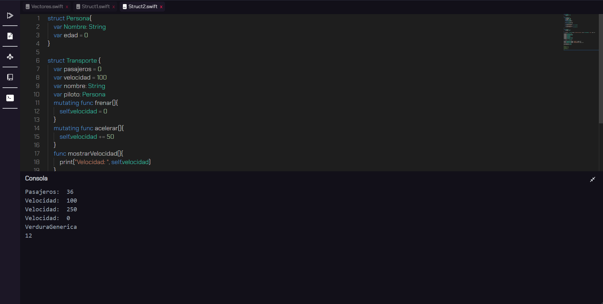
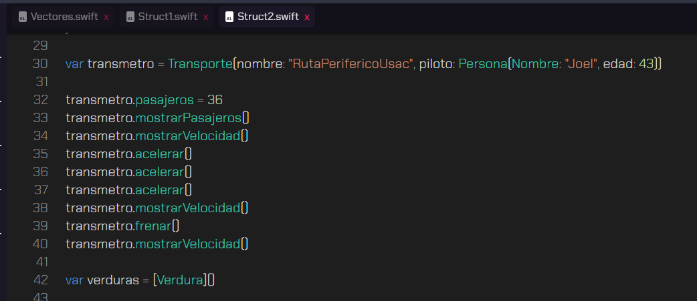
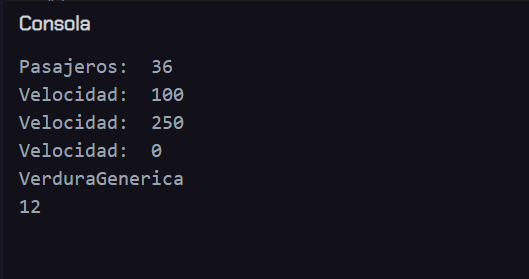
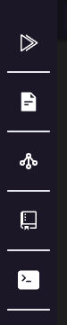
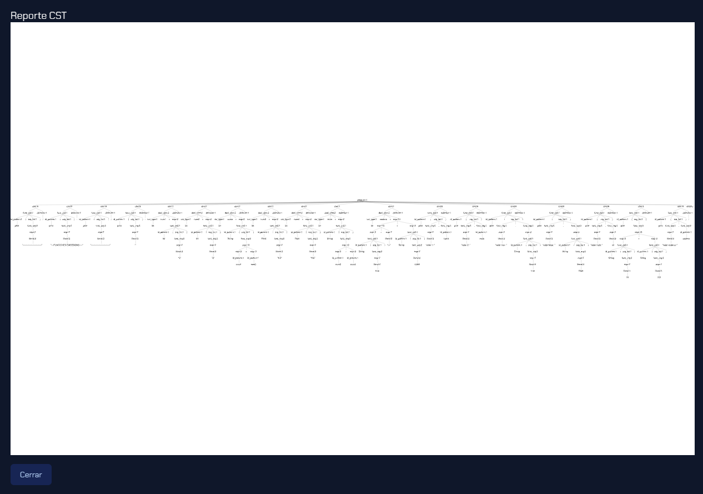
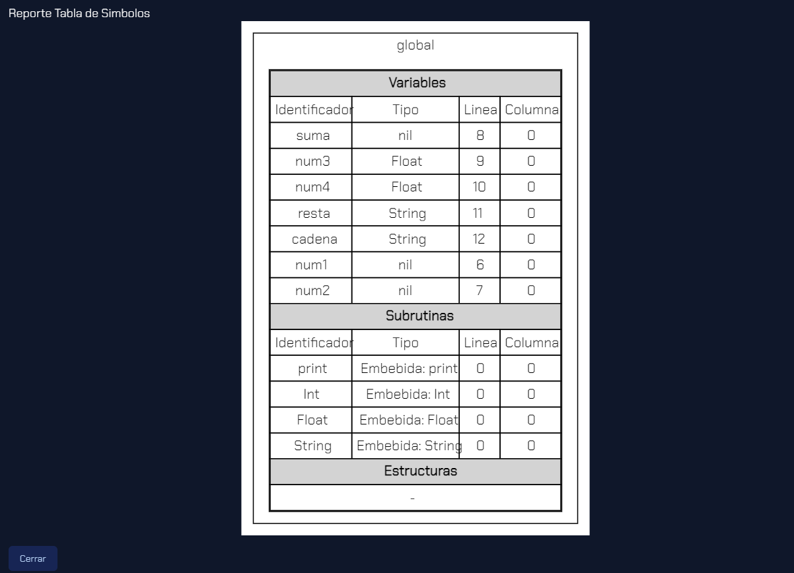

# **Proyecto 2**
### Universidad de San Carlos de Guatemala
### Facultad de Ingeniería
### Escuela de Ciencias y Sistemas
### Organización de Lenguajes y Compiladores 2

## **Manual de Usuario**

| Nombre | Carnet | 
| --- | --- |
| Damián Ignacio Peña Afre | 202110568 |
----

## **Tabla de Contenido**

- [Descripción General](#descripción-general)
- [Interfaz gráfica](#interfaz-gráfica)
- [Editor de texto](#editor-de-texto)
- [Consola](#consola)
- [Barra de herramientas](#barra-de-herramientas)
- [Reportes](#reportes)
  - [Reporte AST](#reporte-ast)
  - [Reporte tabla de símbolos](#reporte-tabla-de-símbolos)
- [Especificación del lenguaje](#especificación-del-lenguaje)
    - [Tipos de datos](#tipos-de-datos)
    - [Variables](#variables)
    - [Asignación](#asignación)
    - [Operadores aritméticos](#operadores-aritméticos)
    - [Operadores relacionales](#operadores-relacionales)
    - [Operadores lógicos](#operadores-lógicos)
    - [Estructuras de control](#estructuras-de-control)
        - [If](#if)
        - [If-else](#if-else)
        - [If-else if-else](#if-else-if-else)
        - [Switch](#switch)
        - [While](#while)
        - [Do-while](#do-while)
        - [For](#for)
    - [Funciones](#funciones)
    - [Métodos](#métodos)
    - [Comentarios](#comentarios)
        - [Comentarios de una línea](#comentarios-de-una-línea)
        - [Comentarios de múltiples líneas](#comentarios-de-múltiples-líneas)
    - [Funcione nativas](#funcione-nativas)
    - [Errores](#errores)
        - [Error léxico](#error-léxico)
        - [Error sintáctico](#error-sintáctico)
        - [Error semántico](#error-semántico)

## **Descripción General**

T-Swift es un lenguaje de programación basado en el popular lenguaje Swift. Swift es ampliamente reconocido por su sintaxis moderna y sus características distintivas que lo han convertido en una elección preferida en el mundo de la programación. T-Swift hereda estas cualidades, lo que lo convierte en un lenguaje multiparadigma versátil y en constante crecimiento.

### Características Destacadas
T-Swift se destaca por incorporar características avanzadas que lo hacen adecuado para una amplia gama de aplicaciones. Algunas de sus características más notables incluyen:

1. Programación Funcional: T-Swift permite la implementación de conceptos de programación funcional, lo que facilita la escritura de código más claro y conciso.

2. Tipado Estático: Con un sistema de tipado estático robusto, T-Swift ayuda a detectar errores en tiempo de compilación, lo que conduce a un código más seguro y confiable.

3. Inferencia de Tipos: La inferencia de tipos en T-Swift simplifica la declaración de variables al permitir que el compilador deduzca automáticamente los tipos de datos, lo que reduce la verbosidad del código.


## **Interfaz gráfica**



La interfaz gráfica se divide en tres secciones principales: el editor de texto, la consola y la barra de herramientas. A continuación, se describen las funcionalidades de cada una de estas secciones.


### **Editor de texto**

El editor de texto es el área principal de la interfaz gráfica. En esta sección se puede escribir el código fuente del programa que se desea compilar. El editor de texto cuenta con las siguientes funcionalidades:



### **Consola**

La consola es el área donde se muestran los mensajes de salida del compilador. En esta sección se puede visualizar el resultado de la compilación del programa. La consola cuenta con las siguientes funcionalidades:




### **Barra de herramientas**

La barra de herramientas es el área donde se encuentran los botones para ejecutar las diferentes funcionalidades del compilador. La barra de herramientas cuenta con las siguientes funcionalidades:    




### **Reportes**

### Reporte CST

Un arbol de sintaxis concreta (CST) es un árbol de derivación que representa la estructura sintáctica de una cadena de entrada de acuerdo con una gramática formal. El CST se genera durante el proceso de análisis sintáctico y se utiliza para verificar si la cadena de entrada es sintácticamente correcta. El CST se puede visualizar en la interfaz gráfica de la siguiente manera:



### Reporte tabla de símbolos

La tabla de símbolos es una estructura de datos que se utiliza para almacenar información sobre los identificadores definidos en el programa. La tabla de símbolos se puede visualizar en la interfaz gráfica de la siguiente manera:



## **Especificación del lenguaje**

### **Tipos de datos**

- Int: Acepa números enteros positivos y negativos.
- Float: Acepta números decimales positivos y negativos.
- String: Acepta cadenas de caracteres.
- Bool: Acepta valores booleanos (true, false).
- Character: Acepta caracteres individuales.

Adicionalmente, el lenguaje cuenta con tipos de datos compuestos:

- Vector: Acepta una lista de valores de un mismo tipo de dato.
- Matriz: Acepta una lista de vectores de un mismo tipo de dato.
- Structs: Plantilla de datos que permite agrupar diferentes tipos de datos.

### **Variables**


Existen tres formas de declarar una variable:
```swift
// declaración con tipo y valor
var <identificador> : <Tipo> = <Expresión>
// declaración con valor
var <identificador> = <Expresión>
// declaración con tipo y sin valor
var <identificador> : <Tipo> ?
```

### **Asignación**

La asignación de variables se realiza de la siguiente manera:
```swift
<identificador> = <Expresión>
```

### **Operadores aritméticos**

- Suma: +
- Resta: -
- Multiplicación: *
- División: /
- Módulo: %

### **Operadores relacionales**

- Igual: ==
- Diferente: !=
- Mayor que: >
- Menor que: <
- Mayor o igual que: >=
- Menor o igual que: <=

### **Operadores lógicos**

- And: &&
- Or: ||
- Not: !

### **Estructuras de control**

#### **If**

```swift
if <Expresión> {
    <Instrucciones>
}
```

#### **If-else**

```swift
if <Expresión> {
    <Instrucciones>
} else {
    <Instrucciones>
}
```

#### **If-else if-else**

```swift
if <Expresión> {
    <Instrucciones>
} else if <Expresión> {
    <Instrucciones>
} else {
    <Instrucciones>
}
```

#### **Switch**

```swift
switch <Expresión> {
    case <Expresión>:
        <Instrucciones>
    case <Expresión>:
        <Instrucciones>
    default:
        <Instrucciones>
}
```

#### **While**

```swift	
while <Expresión> {
    <Instrucciones>
}
```
#### **For**

```swift
for <identificador> in <Expresión> {
    <Instrucciones>
}
```

### **Funciones**


```swift
func <identificador> (<Parámetros>) -> <Tipo> {
    <Instrucciones>
}
```

### **Comentarios**

#### **Comentarios de una línea**

```swift
// Comentarios de una línea
```
#### **Comentarios de múltiples líneas**

```swift
/* Comentarios de múltiples líneas */
```


### **Funciones nativas**

- print: Imprime un mensaje en la consola.
- Int: Convierte un valor a tipo Int.
- Float: Convierte un valor a tipo Float.
- String: Convierte un valor a tipo String.


## **Errores**
### **Error léxico**

Este tipo de error se produce cuando el analizador léxico no puede reconocer un token en la cadena de entrada. Por ejemplo, si se ingresa un símbolo que no pertenece al lenguaje, se produce un error léxico.

### **Error sintáctico**

Este tipo de error se produce cuando el analizador sintáctico no puede generar un árbol de análisis sintáctico para la cadena de entrada. Por ejemplo, si se ingresa una instrucción que no pertenece al lenguaje, se produce un error sintáctico.

### **Error semántico**

Este tipo de error se produce cuando el analizador semántico detecta un error en el código fuente. Por ejemplo, si se intenta asignar un valor de tipo String a una variable de tipo Int, se produce un error semántico.
